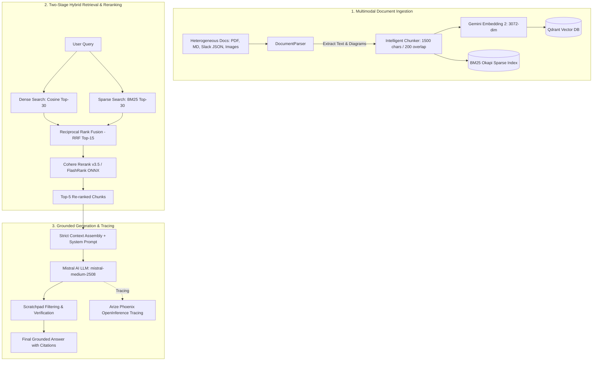

# Enterprise Applied RAG with Strict Evaluation & Observability

[](https://www.python.org/)
[](https://fastapi.tiangolo.com/)
[](https://react.dev/)
[](https://www.typescriptlang.org/)
[](https://vitejs.dev/)
[](https://qdrant.tech/)
[](https://mistral.ai/)
[](https://cohere.com/)
[](https://phoenix.arize.com/)

An enterprise-grade Retrieval-Augmented Generation (RAG) system built to answer employee questions across heterogeneous internal knowledge bases (PDFs, Markdown runbooks, Slack message threads, and visual architectural diagrams) with **strict citation grounding**, **automated CI/CD evaluation**, and **full-trace OpenInference observability**.

Operates as a high-performance decoupled architecture (**FastAPI** backend on Render + **React 19 / TypeScript** frontend on Vercel), running **100% Python with Zero-Docker local embedded support**.

---

## 📑 Table of Contents

- [Key Architectural Pillars](#-key-architectural-pillars)
- [System Architecture & Workflow](#-system-architecture--workflow)
- [Project Structure](#-project-structure)
- [Environment Configuration](#-environment-configuration)
- [Quickstart & Local Development](#-quickstart--local-development)
  - [1. Prerequisites & Virtual Environment](#1-prerequisites--virtual-environment)
  - [2. Configure Environment Variables](#2-configure-environment-variables)
  - [3. Ingest Enterprise Documents](#3-ingest-enterprise-documents)
  - [4. Launch the Applications](#4-launch-the-applications)
- [Automated CI/CD Evaluation & LLM-as-a-Judge](#-automated-cicd-evaluation--llm-as-a-judge)
- [Observability & Tracing (Arize Phoenix)](#-observability--tracing-arize-phoenix)
- [REST API Reference](#-rest-api-reference)
- [Production Deployment Guide](#-production-deployment-guide)
  - [Deploy Backend to Render](#1-deploy-backend-to-render)
  - [Deploy Frontend to Vercel](#2-deploy-frontend-to-vercel)
  - [Docker Container Deployment](#3-docker-container-deployment)
- [Security & Secrets Hygiene](#-security--secrets-hygiene)

---

## ⚡ Key Architectural Pillars

1. **Zero Hallucination Grounding & Explicit Citations**
   - The generation engine enforces strict system-level constraints: any claim not supported by retrieved contexts is omitted.
   - Formatted citations identify exact source coordinates:
     - **PDFs:** `[Source: document.pdf, Page <N>, Section/Figure <ID>]`
     - **Markdown:** `[Source: runbook.md, Section: <Heading>]`
     - **Slack:** `[Source: chat.json, Channel: #<channel>]`

2. **Multimodal Visual Diagram Ingestion**
   - PDF figures, technical drawings, and image assets are extracted, compressed, and embedded into the joint 3072-dimensional vector space using Google's **`gemini-embedding-2`**.
   - Diagram previews and Base64-encoded visual assets are returned alongside text passages and rendered inline in the frontend.

3. **Hybrid Fusion Search (Dense + Sparse)**
   - **Dense Retrieval:** Cosine vector similarity via **`gemini-embedding-2`** (3072 dimensions) indexed in **Qdrant** (Local Embedded or Cloud).
   - **Sparse Retrieval:** Exact keyword matching via an in-memory **BM25 Okapi** index with tech-term tokenization and stopword optimization.
   - **Reciprocal Rank Fusion (RRF):** Fuses dense and sparse rankings ($k=60$) to surface relevant passages even when technical keywords and semantic intent diverge.

4. **Two-Stage Cross-Encoder Reranking**
   - Candidate pool of top-$K$ ($K=15$) results is reranked down to top-$N$ ($N=5$) high-relevance chunks using **Cohere Rerank v3.5** (`rerank-v3.5`).
   - Resilient zero-latency fallback to local ONNX **FlashRank** (`ms-marco-TinyBERT-L-2-v2`) if external APIs are unavailable or unconfigured.

5. **Production Generation Engine**
   - Powered by **Mistral AI** (`mistral-medium-2508` via OpenAI-compatible SDK).
   - Automatic post-processing filters reasoning scratchpads (`<think>` blocks and internal thoughts) to ensure clean, professional output.

6. **Continuous Golden Dataset Benchmarking**
   - Automated LLM-as-a-Judge benchmark evaluates **Faithfulness**, **Context Precision**, **Context Recall**, and **Answer Relevancy**.
   - Built-in pass/fail regression gates (Faithfulness $\ge 0.80$, Recall $\ge 0.75$) protect production releases in CI/CD pipelines.

---

## 🏗️ System Architecture & Workflow



---

## 📁 Project Structure

```
project1sv/
├── api.py                            # FastAPI ASGI backend server (REST API for Render/production)
├── ingest.py                         # Offline document parsing, chunking, and indexing pipeline
├── run_eval.py                       # Automated CI/CD evaluation runner with threshold verification
├── run_phoenix.py                    # Standalone Arize Phoenix observability server launcher
├── generate_qa_dataset.py            # Synthetic Golden Dataset generation utility
├── golden_dataset.json               # Curated Q&A test cases with ground-truth references
├── synthetic_golden_qa.json          # Extended synthetic evaluation dataset
├── requirements.txt                  # Python dependencies
├── render.yaml                       # Render Blueprint deployment definition
├── Dockerfile                        # Multi-stage production container definition
├── .env.example                      # Environment variables template (safe placeholder copy)
├── .gitignore                        # Git ignore rules protecting .env, storage, and caches
├── data/                             # Raw input enterprise documents (PDF, MD, Slack, TXT)
│   ├── 3M_2015_10K.pdf
│   ├── ADOBE_2015_10K.pdf
│   ├── ADOBE_2016_10K.pdf
│   ├── aci-318_compress.pdf
│   ├── corporate_security_policy.txt
│   ├── devops_incident_runbook.md
│   └── engineering_slack_chat.json
├── storage/                          # Local embedded persistence (Zero-Docker)
│   ├── qdrant_db/                    # Embedded Qdrant vector database storage
│   └── flashrank_cache/              # Local ONNX cross-encoder model cache
├── src/                              # Core RAG engine modules
│   ├── config.py                     # Centralized configuration & environment loader
│   ├── parser.py                     # Multi-format document & multimodal diagram parser
│   ├── chunker.py                    # Recursive semantic text chunker
│   ├── embeddings.py                 # Google AI Studio Gemini Embedding 2 client (3072-dim)
│   ├── vector_store.py               # Qdrant Client + BM25 Hybrid Store with RRF
│   ├── reranker.py                   # Cohere v3.5 Reranker + FlashRank ONNX fallback
│   ├── llm.py                        # Mistral AI client with retry, streaming, & trace cleaning
│   ├── rag_engine.py                 # Pipeline orchestrator (Retrieve -> Rerank -> Prompt -> Generate)
│   ├── evaluation.py                 # LLM-as-a-Judge benchmark engine (RAGAS-aligned)
│   └── observability.py              # Arize Phoenix OpenInference instrumentation
└── frontend/                         # Modern React/TypeScript Single Page Application
    ├── index.html                    # SPA HTML entrypoint
    ├── package.json                  # Frontend dependencies (React 19, Vite, Lucide, React-Markdown)
    ├── tsconfig.json                 # TypeScript configuration
    ├── vite.config.ts                # Vite build configuration
    ├── vercel.json                   # Vercel SPA routing rules
    ├── .env.example                  # Frontend environment template (VITE_API_URL)
    └── src/
        ├── App.tsx                   # Multi-tab UI (Chat, Document Manager, Evaluation, System Info)
        ├── api.ts                    # Backend REST API client
        ├── types.ts                  # Shared TypeScript interfaces
        └── index.css                 # Enterprise typography and layout styles
```

---

## 🔐 Environment Configuration

Create a `.env` file in the root directory by copying the provided `.env.example`:

```bash
cp .env.example .env
```

Populate the configuration values with your credentials:

| Environment Variable | Required | Default Value | Description |
| :--- | :---: | :--- | :--- |
| `GEMINI_API_KEY` | **Yes** | — | Google AI Studio API key for `gemini-embedding-2` (3072 dims) |
| `GEMINI_EMBEDDING_MODEL` | No | `models/gemini-embedding-2` | Gemini embedding model identifier |
| `MISTRAL_API_KEY` | **Yes** | — | Mistral AI API key for generation |
| `MISTRAL_MODEL` | No | `mistral-medium-2508` | Mistral model identifier |
| `MISTRAL_BASE_URL` | No | `https://api.mistral.ai/v1` | Mistral API endpoint |
| `COHERE_API_KEY` | Optional | — | Cohere API key for `rerank-v3.5` (falls back to local FlashRank if omitted) |
| `COHERE_RERANK_MODEL` | No | `rerank-v3.5` | Cohere Rerank model identifier |
| `QDRANT_URL` | Optional | `""` (empty) | Qdrant Cloud cluster endpoint. Leave empty to use local embedded storage |
| `QDRANT_API_KEY` | Optional | `""` (empty) | API key for Qdrant Cloud cluster |
| `QDRANT_STORAGE_PATH` | No | `./storage/qdrant_db` | Local filesystem path for embedded Qdrant |
| `QDRANT_COLLECTION_NAME`| No | `enterprise_knowledge_base` | Collection name in Qdrant |
| `OPENROUTER_API_KEY` | Optional | — | Fallback LLM provider key if Mistral is unconfigured |
| `OPENROUTER_MODEL` | No | `nvidia/nemotron-3.5-lightning:free` | Fallback LLM model name |
| `PORT` | No | `8000` | Port for the FastAPI backend server |

> [!NOTE]
> **Zero-Docker Operation:** By default, if `QDRANT_URL` is left blank, the system automatically uses local embedded Qdrant (`./storage/qdrant_db`). No Docker daemon or external database service is required for local development.

---

## 💻 Quickstart & Local Development

### 1. Prerequisites & Virtual Environment

- **Python:** 3.11 or 3.12
- **Node.js:** 18+ and npm (for the React frontend)
- Git

```bash
# Clone the repository
git clone https://github.com/<your-username>/<your-repo-name>.git
cd project1sv

# Create and activate Python virtual environment
python -m venv venv

# On Linux/macOS:
source venv/bin/activate
# On Windows (PowerShell):
.\venv\Scripts\Activate.ps1

# Install Python dependencies
pip install -r requirements.txt
```

### 2. Configure Environment Variables

```bash
cp .env.example .env
# Edit .env and insert your GEMINI_API_KEY, MISTRAL_API_KEY, and optional COHERE_API_KEY
```

### 3. Ingest Enterprise Documents

Place your files (PDF, Markdown, Slack JSON, TXT, or images) into the `data/` directory and run:

```bash
python ingest.py
```

This will:
1. Parse all documents and extract text and multimodal diagrams.
2. Recursively chunk content into 1,500-character segments with 200-character overlap.
3. Compute 3,072-dimensional Gemini embeddings.
4. Index vectors into Qdrant and construct the BM25 sparse index.

### 4. Launch the Applications

**1. Start the FastAPI Backend:**
```bash
uvicorn api:app --reload --port 8000
```
- API Base URL: `http://localhost:8000`
- Interactive OpenAPI Swagger Docs: `http://localhost:8000/docs`

**2. Start the React/Vite Frontend:**
```bash
cd frontend
cp .env.example .env
npm install
npm run dev
```
- Web Application: `http://localhost:5173`

---

## 📊 Automated CI/CD Evaluation & LLM-as-a-Judge

Enterprise RAG requires regression testing to guarantee that changes to prompts, chunking sizes, or retrieval parameters do not introduce hallucinations or degrade answer quality.

Run the evaluation benchmark against the curated Golden Dataset:

```bash
python run_eval.py --dataset golden_dataset.json --output eval_report.json
```

### Evaluation Metrics

| Metric | Target Gate | Description |
| :--- | :---: | :--- |
| **Faithfulness** | $\ge 0.80$ | Verifies that all factual claims made in the answer are strictly supported by retrieved context passages (hallucination defense). |
| **Context Precision** | $\ge 0.70$ | Measures whether the most relevant passages appear at the top of the retrieved context without noisy distractors. |
| **Context Recall** | $\ge 0.75$ | Evaluates whether retrieved contexts encompass all facts required to answer against the ground truth. |
| **Answer Relevancy** | $\ge 0.80$ | Confirms the generated answer directly addresses the user's inquiry without extraneous digressions. |

The script evaluates each Q&A pair with an LLM judge, prints a summary report, exports `eval_report.json`, and exits with code `0` (Passed) or non-zero (Failed threshold), making it plug-and-play for GitHub Actions or GitLab CI.

---

## 🔭 Observability & Tracing (Arize Phoenix)

Every query through the RAG engine can be traced using **Arize Phoenix** (OpenInference / OpenTelemetry standard).

1. Start the Phoenix server:
   ```bash
   python run_phoenix.py
   ```
2. Open your browser to `http://localhost:6006` to inspect:
   - Complete execution span trees (Retrieval $\rightarrow$ Reranking $\rightarrow$ LLM generation).
   - Token counts (Prompt vs. Completion tokens).
   - Latency breakdowns across each pipeline component.
   - Input contexts and output completions.

---

## 📡 REST API Reference

The FastAPI backend exposes the following asynchronous REST endpoints:

| Method | Endpoint | Description |
| :--- | :--- | :--- |
| `GET` | `/api/health` | Health check endpoint and Qdrant connection status |
| `GET` | `/api/system-info` | Active models, vector DB target, embedding dimensions, and configuration |
| `POST` | `/api/query` | Executes full RAG pipeline (Retrieval + Rerank + Mistral generation + Citations) |
| `GET` | `/api/documents` | Lists all documents in the `data/` directory with file size and timestamps |
| `POST` | `/api/documents/upload`| Accepts multipart file uploads, writes them to `data/`, and re-indexes Qdrant |
| `POST` | `/api/documents/reindex` | Re-indexes all existing documents in `data/` |
| `GET` | `/api/evaluation/datasets` | Lists available evaluation datasets (`golden_dataset.json`, etc.) |
| `POST` | `/api/evaluation/run` | Triggers on-demand benchmark evaluation and returns aggregated metrics |

### Example Query Request (`POST /api/query`)

```bash
curl -X POST http://localhost:8000/api/query \
  -H "Content-Type: application/json" \
  -d '{"query": "What is the procedure for handling a Sev-1 Kubernetes outage?"}'
```

---

## 🚀 Production Deployment Guide

### 1. Deploy Backend to Render

1. Create a new Web Service in [Render Dashboard](https://dashboard.render.com/) connected to your repository (or use the Blueprint pointing to `render.yaml`).
2. Configure settings:
   - **Environment:** `Python`
   - **Build Command:** `pip install -r requirements.txt`
   - **Start Command:** `uvicorn api:app --host 0.0.0.0 --port $PORT`
3. Add Environment Variables in Render Dashboard:
   - `GEMINI_API_KEY`: Your Google AI Studio key
   - `MISTRAL_API_KEY`: Your Mistral AI key
   - `MISTRAL_MODEL`: `mistral-medium-2508`
   - `COHERE_API_KEY`: Your Cohere key *(optional, uses FlashRank if omitted)*
   - `QDRANT_URL`: Your Qdrant Cloud cluster endpoint *(e.g. `https://xxx.eu-central.aws.cloud.qdrant.io:6333`)*
   - `QDRANT_API_KEY`: Your Qdrant Cloud cluster API key
4. Copy your backend service URL (e.g. `https://enterprise-rag-api.onrender.com`).

### 2. Deploy Frontend to Vercel

1. Import your repository into [Vercel](https://vercel.com/new).
2. Configure project settings:
   - **Root Directory:** `frontend`
   - **Framework Preset:** `Vite`
   - **Build Command:** `npm run build`
   - **Output Directory:** `dist`
3. Set the Environment Variable in Vercel:
   - `VITE_API_URL`: Your deployed Render backend URL (`https://enterprise-rag-api.onrender.com`).
4. Click **Deploy**.

### 3. Docker Container Deployment

Build and run the container locally or on any container platform:

```bash
# Build the Docker image
docker build -t enterprise-rag:latest .

# Run container with environment file
docker run -p 8000:8000 --env-file .env enterprise-rag:latest
```

---

## 🔒 Security & Secrets Hygiene

> [!CAUTION]
> **API Key Rotation Notice:**
> If an API key was ever accidentally committed to a public or shared git repository, consider it compromised immediately.
> 1. **Rotate/Revoke Immediately:** Go to [Mistral Console](https://console.mistral.ai/) and [Cohere Dashboard](https://dashboard.cohere.com/) and revoke any previously exposed keys.
> 2. **Keep `.env` Untracked:** Verify that `.env` is listed in your `.gitignore` before committing changes.
> 3. **Never Hardcode Secrets:** Always reference secrets via environment variables (`os.environ` / `src.config.settings`).
> 4. **Purging Git History:** If you need to permanently remove a sensitive string from past git commits, use tools such as [git-filter-repo](https://github.com/newren/git-filter-repo) or [BFG Repo-Cleaner](https://rtyley.github.io/bfg-repo-cleaner/).

---

## 📄 License

This project is licensed under the [MIT License](LICENSE).
